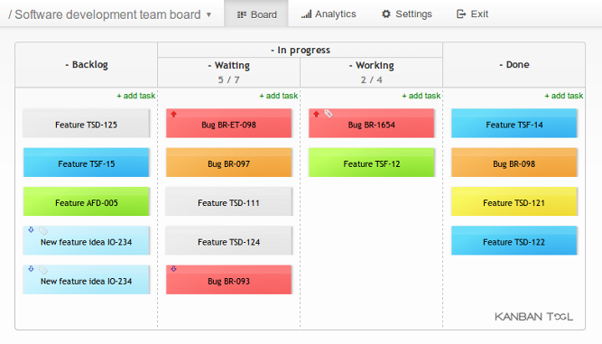

 Departamento de Computação (DComp-So) 
 Centro de Ciências e Gestão em Tecnologias (CCGT) 
 UNIVERSIDADE FEDERAL DE SÃO CARLOS - Campus Sorocaba   

# Sobre

Material criado para o seminário que aborda DevSecOps como parte da avaliação da disciplina de Engenharia de Software (2021/2) - Prof. Dr. Alexandre Alvaro, do programa de mestrado em Ciência da Computação da UFScar Sorocaba.

# DevSecOps
Autores: [Ailton Morais](https://github.com/ailtonmorais) & [Alex Rocha](https://github.com/alrocha003)

# Índice
1. [Introdução](#introducao)    
	1.1. [O que é DevOps](#sobre-devops) 
	1.2. [Cultura DevOps](#cultura-devops) 
    1.3. [Pilares da Cultura DevOps](#pilares-cultura-devops) 
    1.3.1. [Integração Contínua](#integracao-continua) 
    1.3.2. [Feedback Contínuo](#feedback-continuo) 
    1.3.3. [Implantação Contínua](#implantacao-continua) 
    1.4. [DevOps & Lean](#devops-lean)
2. [Qual a importância do DevOps](#importancia-devops)    
	2.1. [Benefícios do DevOps](#beneficios-devops) 
    2.1.1. [Integrar as Equipes](#integrar-equipes) 
    2.1.2. [Identificar Possíveis Melhorias](#identificar-melhorias) 
    2.1.3. [Facilitar a Adoção de Novas Tecnologias](#facilitar-novas-tecnologias) 
    2.1.4. [Automatizar Atividades](#automatizar-atividades) 
    2.1.5. [Elaborar Novas Estratégias](#elaborar-estratégias)        
3. [Onde Entra a Segurança no Ciclo DevOps](#inicio-seg-devops) 
   3.1. [Boas práticas para garantir a segurança na aplicação DevOps](#boaspraticas-devops) 
   3.2. [Adapte política e governança](#adapte-cultura) 
   3.3. [Automatize processos e ferramentas de segurança](#auto-seg) 
   3.4. [Utilize recursos seguramente testados e aprovados](#recursos-devops) 
   3.5. [Gerencie a vulnerabilidade](#gerencie-seg) 
   3.6. [Gerencie as configurações](#gerencie-config) 
   3.7. [Faça o gerenciamento seguro de credenciais de acesso privilegiado](#credencial) 
   3.8. [Faça a gestão de acesso privilegiado (PAM)](#pam) 
   3.9. [Faça a segmentação de redes](#seg-rede) 
   3.10. [Adote um modelo DevSecOps](#modelo-devsecops)
4. [DevOps vs DevSecOps](#devops-devsecops) 
   4.1. [Aprimoramento e proatividade em segurança](#proatividade-seg) 
   4.2. [Correção de vulnerabilidade de segurança acelerada](#acelera-seg)
5. [O que muda com o DevSecOps](#mudanca-devsecops)
6. [Quais os Benefícios do DevSecOps para o Negócio](#beneficios-devsecops)
7. [Como Implementar DevSecOps](#implementar-devsecops)
8. [Considerações Finais](#conclusao)
9.  [Referências Bibliográficas](#referencias)

## 1. Introdução

A busca por vantagem competitiva e maior participação no mercado tem levado empresas de diferente setor a utilizar cada vez mais softwares na sua operação e departamentos. Com essa premissa o desafio é conseguir entregar software com a maior rapidez possível, menor custo e baixo risco.

Neste trabalho vamos explorar os conceitos, histórias de sucesso, importância da adoção do DevSecOps e formas de implementá-lo. Antes de iniciar o tema, vamos listar os principais mitos que são propagados e que foram citados por Kim, et al. (2018).

1. **DevOps é somente para startups:** Sabe-se que DevOps é altamente utilizado e difundido neste tipo de organizações, mas no decorrer deste trabalho veremos histórias de sucesso em diferentes tipos de organizações.

2. **DevOps substitui as metodologias ágeis:** Certamente temos muitas similaridades entre ambas abordagens e sem dúvida uma empresa ou departamento que já adota uma metodologia ágil terá mais facilidades de implantar alguns dos pilares do DevOps, mas veremos que isso vai muito além do uso de uma metodologia ágil.
  
3. **DevOps é incompatível com ITIL:** Ao abordar gerenciamento de configuração, serviço, incidentes e gestão de problema pode parecer que ao adotar o DevOps vamos eliminar todos os processos do ITIL. A proposta do DevOps é na realidade automatizar todos os processos possíveis, inclusive os que geralmente pertencem a equipe de operação, tendo sempre o objetivo de diminuir o tempo de execução das etapas que geram valor para o cliente.

4. **DevOps é incompatível com segurança da informação e conformidade:** Aqui podemos ver uma mudança radical na forma de lidar com segurança e conformidade na cadeia de desenvolvimento de software, pois ao invés de adicionar as atividades de segurança apenas na etapa final do projeto, deve-se implantar este controle em cada etapa do desenvolvimento de software para alcançar a segurança e conformidade tão importantes para as organizações.

5. **DevOps significa eliminar as operações de TI, ou “NoOps”:** A proposta não é eliminar a equipe de operações, mas alterar a forma de trabalho. A cooperação entre a equipe de desenvolvimento e operações passam a ser implementados em todo o ciclo de desenvolvimento de software e a automatização operacional realizada certamente vai liberar tempo para manter o foco no negócio e fazer as melhorias necessárias.

6. **DevOps é apenas infraestrutura como código ou automação:** A automação é uma premissa para implantação de DevOps, mas exige também a mudança na cultura organizacional para que todos os setores que participam da entrega de valor de TI possam trabalhar com o mesmo objetivo.
   
7. **DevOps só serve para código Open Source:** Temos um número grande empresas de tecnologias que utilizam software livre em seus projetos, mas podemos encontrar histórias de sucesso em qualquer tipo de tecnologia utilizada. 

### 1.1. O que é DevOps

Podemos entender o DevOps como a união de ferramental e cultura no processo de desenvolvimento de software, sendo um conjunto de práticas para viabilizar a integração entre as equipes de desenvolvimento de software, controle de qualidade, suporte e infraestrutura através da automação de processos para entrega de software. DevOps também se trata de cultura a ser adotada pela empresa e pelos times envolvidos no ciclo de vida do produto de software.

 Figura 1: DevOps Flow 

A forma convencional de desenvolvimento de produtos de software adotada por diversas empresas, públicas e privadas, de diversos tamanhos e fins supõe que os times de Desenvolvimento de Operações trabalhem em diferentes setores de um determinado negócio, tendo finalidades distintas e  fazendo com que esses times não compartilhem das mesmas motivações e comprometimento com os processos no ciclo de desenvolvimento de software.

Isso ocorre não por um time se preocupar mais que o outro na entrega, mas por esses times possuírem visões diferentes do que é o pronto em suas atividades. O time de desenvolvimento irá focar na sua entrega da base de código, o time de infraestrutura irá focar nos servidores funcionando, já o time de sustentação terá seu sucesso baseado na quantidade de chamados abertos e fechados.

As equipes de desenvolvimento adotando as metodologias ágeis e trabalhando de forma mais alinhada ao negócio da empresa já consegue realizar alterações e implementações mais complexas de forma mais rápida e ágil do que da forma convencional. Desta forma conseguem atender a expectativa dos clientes valorizando o produto de software, já as áreas de operação prezam pela estabilidade do produto de software, dessa forma quanto menos alterações no ambiente de produção melhor, pois essas alterações podem gerar instabilidade e bugs impactando o usuário final, desvalorizando o produto de software da empresa.

### 1.2. Cultura DevOps

Sobre os pilares da cultura DevOps, podemos entender que o mesmo se trata de uma cultura, não apenas um conjunto de ferramentas tecnológicas a serem utilizadas. É fundamental garantir a Integração Contínua, Feedback Contínuo e Implantação Contínua. Pelos pilares já é possível entender que o DevOps é implementado na tentativa de alcançar a máxima agilidade, assertividade e velocidade na implantação e reversão de mudanças na implementação e entrega do produto de software.

## 1.3. Pilares da Cultura DevOps

### 1.3.1. Integração Contínua

No âmbito da Cultura DevOps, integração contínua trata-se da transferência facilitada e maximizada de conhecimento e das experiências adquiridas de forma empírica ou não entre as áreas que impactam e são impactadas pelo produto de software.

Realizar essa integração promove o compartilhamento de ideias, experiências e ajuda na adoção de alguma metodologia no trato do software que permite maior agilidade e confiabilidade na entrega e também na sustentação do produto após a entrega.

É necessário implementar ferramentas e metodologias promovendo essa integração para permitir essa troca de figurinhas entre as equipes que estão envolvidas nas fases do ciclo de vida do software ou serviço, isso ajudará na entrega, sustentação e na diminuição do tempo gasto para determinadas tarefas, essas podendo até ser automatizadas.

### 1.3.2. Feedback Contínuo

Feedback é necessário em qualquer meio, de qualquer negócio, porém se torna essencial como parte da cultura DevOps pois estimula que os times que fazem parte do ciclo de desenvolvimento de software possam aprender com os erros e de seus pares, e encontrar soluções conjuntas para os problemas encontrados, seja na entrega, quanto na sustentação, qualidade, etc.

Criar e manter um canal de feedback contínuo vai se mostrar essencial para a cultura DevOps, pois permitirá que times que anteriormente trabalhavam distantes, agora passem a influenciar nas decisões de execução e planejamento um dos outros, encontrando soluções em comum que beneficiem a entrega do produto de software como um todo.

### 1.3.3. Implantação Contínua

Implantação contínua ajudará na entrega, liberando de forma ágil novas versões de software para o cliente, porém vai além disso, se faz necessário para garantir qualidade podendo integrar um ciclo de teste anteriormente em um pipeline de implantação e também permitindo que ao encontrar determinado erro crítico, após sua correção, realizar uma nova implantação de maneira rápida minimizando os riscos e custos atrelados a uma implantação de software problemática contendo bugs.

Esse pilar também garante estratégia de negócio ao produto de software, pois viabiliza um ciclo de rápidas mudanças, onde um time de desenvolvimento poderá atender uma demanda de negócio/produto implementando e entregando uma nova feature de forma bem menos problemática e complicada do que a convencional.

## 1.4. DevOps & Lean

O DevOps baseia-se muito nas práticas do Lean, que é uma filosofia de gestão inspirada nas práticas do sistema de gestão utilizado do sistema Toyota de produção. A filosofia Lean tem como seus princípios fundamentais: Valor, Fluxo de Valor, Fluxo, Produção Puxada e Perfeição.

O Lean também foca muito em evitar o máximo de desperdício, entendendo que desperdício são componentes do processo que não possuem valor agregado ao projeto em si.

Se tratando de Lean, o valor pode ser definido como a percepção do cliente acerca do resultado do produto ou serviço que será entregue pelo seu trabalho. Realizando um paralelo com DevOps, o Fluxo de valor definido para o mesmo pode ser entendido como um processo necessário para converter uma hipótese de negócio em um produto ou serviço que agregue e entregue valor ao cliente final.

[Voltar ao índice](#indice)

## 2. Qual a importância do DevOps

Apoiar a implantação da cultura de DevOps no ciclo de desenvolvimento de software de qualquer empresa certamente levará a mesma a ganhos expressivos de diversos itens importantes e altamente impactantes para a melhoria e aumento da agilidade na entrega dos produtos de software.

Temos os seguintes itens como pontos de melhoria expressivos do processo:

* **Velocidade:** Aumento na velocidade no processo possibilita que o negócio consiga realizar mudanças estratégicas, correções, mudança do produto de software com confiabilidade e dessa forma consiga garantir sempre a melhor experiência para o cliente.

* **Agilidade na Entrega:** Possibilitando entregas mais rápidas e contínuas é possível realizar entregas de valor aos clientes de forma consistente gerando vantagem competitiva e estratégica para a empresa.

* **Escalabilidade:** Garantir escalabilidade para o projeto permite que o mesmo esteja preparado para lidar com possíveis gargalos de performance, instabilidades, além de permitir uma evolução rápida dos projetos para outros níveis.

* **CI/CD:** Entrega e Integração Contínua é extremamente necessário se tratando de DevOps, pois viabiliza a implementação de pipelines de deploy permitindo assim a entrega contínua de atualizações do produto de software de maneira ágil.

* **Segurança:** Se tratando de DevOps todos os envolvidos no ciclo de desenvolvimento de software devem garantir a segurança no desenvolvimento da aplicação, no teste e na entrega do mesmo.

## 2.1. Benefícios do DevOps

### 2.1.1. Integrar as Equipes

Possibilitar a integração das equipes é extremamente importante dentro do ciclo de DevOps, equipes diferentes no ciclo de desenvolvimento atuando juntas para chegar em um objetivo em comum, nesse caso a entrega do produto de software, gerando assim valor para a companhia e demonstrando a importância desse ponto no ciclo DevOps.

### 2.1.2. Identificar Possíveis Melhorias

Com o time integrado, partilhando informações importantes do negócio e da tecnologia interna, as diferentes áreas do negócio conseguem partilhar sugestões de novas implementações e melhorias que podem impactar de forma positiva o produto de software da empresa.

Alinhando esses pontos com uma constante comunicação e foco no cliente interno ou externo é possível entender a melhor forma de atender as necessidades desses possíveis usuários implementando novas features e corrigindo possíveis problemas.

### 2.1.3. Facilitar a Adoção de Novas Tecnologias

Devido a automatização proporcionada por diversas ferramentas diferentes, utilização de um ou mais provedores de cloud, adotar novas tecnologias, ferramentas para diversos produtos diferentes dentro de uma equipe de desenvolvimento se torna mais prático, ágil e muito menos traumático do que em uma equipe que trabalha de forma convencional. 

Utilizando DevOps podemos atuar de maneiras diferentes para diversos problemas diferentes, o negócio não precisa ficar preso a uma tecnologia específica ou produto e isso garante vantagem estratégica em TI.

### 2.1.4. Automatizar Atividades

Devido a velocidade como as coisas mudam no mundo corporativo e tecnológico, o tempo é um recurso extremamente importante para qualquer profissional e equipe. Equipes inteiras trabalham para utilizar esse recurso da melhor forma possível e o DevOps introduz a automatização de tarefas como chave para utiliza-lo de forma eficiente.

Atualmente não se trata de apenas tarefas repetitivas sem importância, mas também de tarefas de segurança, backups, deploy e implantações também são automatizados a fim de otimizar o trabalho das equipes que interagem com o produto de software garantindo que as mesmas consigam focar em tarefas de maior importância que entreguem valor real para o cliente externo e interno.

Automatizar as atividades dentro dessas equipes trouxe significativo aumento de produtividade o que se traduz em entregas mais rápidas e confiáveis.

### 2.1.5. Elaborar Novas Estratégias

O DevOps contribui também para uma melhor e mais produtiva mudança de estratégia de negócio durante o andamento do projeto e até mesmo depois da entrega.

Também permitindo uma maior integração entre as equipes que interagem com o projeto de software fica mais fácil a identificação de pontos de melhoria e possíveis ajustes até antes mesmo da entrega do software, pois essa integração permite que indivíduos de outras equipes menos enviesados pelo trabalho diretamente com código compartilhem suas ideias e opiniões acerca do software que está sendo desenvolvido, isso pode trazer pontos de melhoria e evolução que a equipe de desenvolvimento e de negócio poderiam não ter pensado.

[Voltar ao índice](#indice)

## 3. Onde Entra a Segurança no Ciclo DevOps

É difícil definir DevOps atualmente, uma série de profissionais está envolvido dentro da cultura e a pouco tempo se fala em Engenheiro de DevOps em vagas e artigos sobre tecnologia pois se trata de uma área relativamente nova.

Geralmente é utilizado um símbolo para definir o DevOps que demonstra dentro de um desenho do símbolo infinito descrevendo as fases pertencentes ao processo de DevOps, planejamento, codificação, construção, teste, lançamento, implementação, operação e monitoramento.

 Figura 2: DevOps Flow 

No entanto, é necessário entender que DevOps se trata de um movimento não exclusivamente técnico, mas cultural, que tem como objetivo reduzir divisão de tarefas das fases de desenvolvimento para tornar as entregas mais ágeis sem sacrificar a qualidade com isso.

Em modelos mais tradicionais, os departamentos de desenvolvimento e operações sempre foram separados. Com o tempo e a disseminação das metodologias ágeis, como Scrum, SAFe, LESS, XP e outros, o setor de desenvolvimento saiu, aos poucos, do modelo cascata com longos ciclos de entrega para um ciclo de adaptações e entrega constante. No entanto, o setor de operações sempre trabalhou com um sistema estável, com muito tempo de preparação para a      fazer implementação e lançamento.

Se por um lado um setor estava evoluindo com metodologias ágeis, o outro estava recebendo atualizações muito mais rápidas que o comum, gerando um fenômeno chamado de Wall of Confusion, ou, parede de confusão. Foi nesse cenário que os setores de desenvolvimento e operações se aproximaram gradualmente, até formar o que conhecemos hoje como DevOps.

No entanto, em uma situação com um número tão grande de atualizações, acontecendo em tão pouco tempo, como podemos garantir a segurança na aplicação de DevOps?

Afinal, a cultura de velocidade e escala também pode influenciar em uma consideração tardia da segurança e quaisquer vulnerabilidades ou configurações criadas incorretamente também podem ter implicações em grande escala.

### 3.1. Boas práticas para garantir a segurança na aplicação DevOps

A segurança faz parte de todo o ciclo de vida do DevOps, mas combiná-la com a agilidade de entrega, atualizações constantes de planejamento e outros princípios essenciais do DevOps requer a implementação de boas práticas.

### 3.2. Adapte política e governança

A criação de políticas e procedimentos de segurança cibernética transparentes, que sejam fáceis para os desenvolvedores e outros membros da equipe entenderem e concordarem, é o passo inicial para aliar proteção e agilidade.

### 3.3. Automatize processos e ferramentas de segurança

Sem ferramentas de segurança automatizadas para análise de código, gerenciamento de configuração, patch e gerenciamento de vulnerabilidade, entre outros, não é possível escalar a segurança.

Além de fundamental nas rotinas de TI, a automação da segurança também minimiza o risco decorrente de erros humanos, bem como o tempo de inatividade ou vulnerabilidades causadas por isso.

Vale lembrar que a empresa enfrenta menos resistência cultural para incorporar práticas de segurança ao DevOps, se os mesmos conceitos protetivos forem incentivados em todos os processos.

### 3.4. Utilize recursos seguramente testados e aprovados

As equipes de operação costumam aproveitar ferramentas novas, imaturas ou de código aberto para gerenciar centenas de grupos de segurança e milhares de instâncias de servidor. Os contêineres – tecnologias que possibilitam o empacotamento e isolamento de aplicações com todo o ambiente de execução delas – podem ser levantados ou baixados rapidamente e rodam na maioria dos sistemas operacionais, bem como em serviços de nuvem.

Frequentemente, as equipes de segurança não têm visibilidade dos próprios contêineres e isso é um fator de risco, visto que compartilham um sistema operacional com outros contêineres. O DevOps, geralmente, depende muito de implantações de nuvem e isso significa que a segurança da nuvem também é uma consideração importante.

À vista disso, entendemos que priorizar a descoberta e validação contínua, sob a gestão de segurança de acordo com sua política de dispositivos, ferramentas, contas, nuvem / instâncias virtuais, contêineres e credenciais é fundamental.

### 3.5. Gerencie a vulnerabilidade

Toda vulnerabilidade deve ser verificada, avaliada e corrigida ainda nos ambientes de desenvolvimento e integração, incluindo dentro dos contêineres que citamos anteriormente, antes da implantação na produção. Quando os produtos são lançados em um ambiente operacional, a segurança DevOps pode executar testes e ferramentas no software de produção e na infraestrutura para identificar e corrigir possíveis hacks e outros problemas.

### 3.6. Gerencie as configurações

A velocidade e a escala dos ambientes DevOps significam que, se algum erro de configuração não puder ser detectado e corrigido rapidamente, ele poderá ser replicado e copiado rapidamente.

A recomendação para evitar que isso aconteça é fazer a varredura para identificar e corrigir configurações incorretas e erros em potencial.

### 3.7. Faça o gerenciamento seguro de credenciais de acesso privilegiado

As equipes de DevOps podem usar diversas ferramentas como Chef, Puppet, Ansible, Salt, etc. Essas ferramentas exigem gerenciamento de segredos, que podem ser credenciais de acesso privilegiada, chaves SSH, tokens de APIs, entre outros.

Esses segredos podem ser usados ​​por humanos ou máquinas (por exemplo, aplicativos, contêineres, microsserviços e instâncias de nuvem). Caso eles sejam gerenciados incorretamente, os mesmos podem facilitar o acesso privilegiado aos invasores através de backdoors e, com isso, a capacidade de adulterar a segurança e outros controles, interromper operações, roubar informações e, basicamente, deter por completo a infraestrutura de TI de uma organização.

É comum que credenciais privilegiadas sejam incorporadas em códigos, scripts, arquivos e contas de serviço. Esse é um equívoco comum e pode permitir que pessoas sem o direito de acessar ambientes privilegiados se apoderem dessas credenciais. Dessa forma, é importante que haja políticas rígidas, proibindo a presença de qualquer tipo de credencial, além disso é possível utilizar ferramentas que detectam tentativas de versionar as credenciais e impeça que elas sejam incorporadas acidentalmente.

### 3.8. Faça a gestão de acesso privilegiado (PAM)

Outro erro comum é dar mais acesso do que o colaborador precisa aos recursos da organização. É comum que esses indivíduos compartilhem credenciais, o que dificulta ou até impossibilita a auditoria das atividades nesses ambientes. O acesso privilegiado excessivo representa um cenário de ameaças ampliado.

Para controlar o risco desse tipo de acesso, é essencial adotar o princípio do menor privilégio. Impor o acesso com privilégios mínimos reduz as oportunidades de invasores, internos ou externos, escalarem os direitos de usuários permitidos e explorarem vulnerabilidades do sistema ou da aplicação. As soluções de gerenciamento de acesso privilegiado empresarial (PAM) podem automatizar o controle, o monitoramento e a auditoria nesses casos, bem como o ciclo de vida completo de segredos / gerenciamento de credenciais.

### 3.9. Faça a segmentação de redes

A segmentação da rede reduz o acesso e o campo de visão dos invasores. A recomendação é o agrupamento de ativos, incluindo servidores de aplicativos e recursos, em unidades lógicas que não confiam umas nas outras.

No caso dos acessos que precisam cruzar as zonas de confiança, é interessante implantar um host administrativo seguro, com autenticação multifator, autorização de acesso adaptável e fazer o monitoramento de sessão para garantir a vigilância.

### 3.10. Adote um modelo DevSecOps

O desalinhamento entre o DevOps e as equipes de segurança pode dar abertura para a criação de códigos inseguros, vulnerabilidades, configurações incorretas, senhas codificadas não protegidas e fragilidade de segurança de aplicativos que causam disfunção operacional ou que sejam alvos fáceis para invasores.

Quando a segurança é incorporada em cada estrutura do ciclo de vida e cultura DevOps, desde o início no design, na construção, nos testes, bem como nas etapas de lançamento, suporte e manutenção, o DevOps passa a ser caracterizado como DevSecOps.

DevSecOps envolve a incorporação de todas as práticas que mencionamos até aqui e outras, pois este, assim como toda metodologia ágil, está em constante evolução. Adotar uma cultura DevSecOps significa que todos compartilham a responsabilidade pela segurança do projeto.

A introdução da segurança na aplicação DevOps, no início do ciclo de vida do produto, reforça o desenvolvimento de aplicativos e sistemas que não vão colocar a tecnologia e as informações da empresa em risco, reduzindo a possibilidade de violações de dados e garantindo o desenvolvimento e o provisionamento de soluções tecnológicas de alto poder mercadológico para atender às necessidades do seu negócio.

[Voltar ao índice](#indice)

## 4. DevOps vs DevSecOps

Podemos definir o DevOps como a união de cultura, metodologias e ferramentas que buscam maximizar a agilidade, qualidade e escalabilidade quando se trata de entregas no ciclo de desenvolvimento de software.

Na concepção do termo e conforme a tecnologia evolui e principalmente nos últimos anos devido os inúmeros ataques que empresas de diversos segmentos sofrem, os especialistas se deram conta que era necessário inserir no ciclo de DevOps a questão da segurança, não basta apenas entregar software com qualidade, agilidade e escalabilidade, é preciso que esse produto seja seguro da concepção até a implantação.

Desses esforços o DevOps ganhou três letras a mais, o Sec de segurança e foi criado o termo DevSecOps, onde temos a metodologia do DevOps com o acréscimo da segurança em todas as fases, fazendo parte do processo.

DevSecOps pode ser entendido como abreviação para desenvolvimento, segurança e operações, visando automatizar a integração da segurança em todo o ciclo de desenvolvimento de software, do início do projeto até a entrega do software.

A ideia do DevSecOps pode ser encarada como uma evolução adaptativa e natural onde as empresas de software procuram abordar de forma mais aprofundada as questões referentes a segurança da informação, que até pouco tempo atrás era majoritariamente tratada como último item de importância a ser verificado no ciclo de desenvolvimento de software, de forma deslocada do processo de desenvolvimento e sem tirar proveito das vantagens que o DevOps pode trazer para o processo.

DevSecOps também resolve um problema criado pela adoção do DevOps nas companhias de desenvolvimento de software. Ocorre que com a adoção das práticas de metodologias Ágeis alinhadas ao DevOps na intenção de tornar o processo de integração, deploy e entrega mais rápido, foram percebidos certos gargalos na questão de segurança no processo de desenvolvimento.

Com toda a automatização entregue pelo DevOps, algumas falhas de processo e segurança estavam sendo descobertas apenas no ambiente de produção, sendo a única oportunidade das equipes corrigirem os problemas identificados.

Tudo isso se torna possível devido a integração fantástica dos processos e ferramentas de metodologias Ágeis e DevOps que existem, e que conseguem integrar os conceitos de segurança na aplicação e infraestrutura.

Atualmente os principais serviços de cloud pública (AWS, Microsoft Azure e Google Cloud Platform) possuem ferramentas internas para trabalhar com Agile e DevOps, criando controles de tarefas, Kanbans, pipelines de deploy, integração, diferentes formas de autenticação e infraestrutura provisionada.

Acompanhe abaixo os 2 benefícios imediatos da adoção do DevSecOps em relação  ao DevOps, que claramente já compensam sua implementação em qualquer projeto.

### 4.1. Aprimoramento e proatividade em segurança

O DevSecOps se preocupa em realizar a verificação do nível de segurança em todas as fases do ciclo de desenvolvimento de software. Desta forma o código é revisado, verificado, submetido a todos os testes possíveis de segurança, e caso seja diagnosticado algum problema, o mesmo é corrigido com o ajuda de toda automação e integração dos processos de deploy e implantação trazidos pelo DevOps, e consequentemente o produto de software poderá ser entregue e implementado com as devidas correções.

Vale ressaltar que atuar dessa maneira com os problemas de segurança de uma aplicação contribuem para uma melhor economia dos recursos financeiros de um projeto, visto que corrigir esse tipo de problema no início do desenvolvimento é expressivamente mais barato do que nos estágios posteriores.

Vale também ressaltar que uma colaboração acertada entre as equipes de engenharia, segurança e operações irá beneficiar a empresa no momento de reagir aos possíveis problemas de segurança, e até mesmo evitá-los de forma sistêmica, deixando tempo para atividades que agreguem mais valor ao projeto.

### 4.2. Correção de vulnerabilidade de segurança acelerada

AIdentificar vulnerabilidades de segurança é o objetivo de se trabalhar as questões de segurança no projeto de software e o DevSecOps trata isso de forma acelerado, se valendo das facilidades implementadas pelo DevOps, como a automatização de processos, ferramentas, integração entre as equipes, etc.

Esse aumento na velocidade de identificação e correção das vulnerabilidades é a peça chave do DevSecOps, integrando varredura de vulnerabilidades e atuando nas correções no ciclo de liberação a capacidade de identificar e corrigir vulnerabilidades e exposições comuns (CVE) torna-se menor, dessa forma o processo consegue diminuir a janela que um possível ator de ameaça conseguiria aproveitar essa vulnerabilidade para realizar ataques e roubar informação.

[Voltar ao índice](#indice)

## 5. Quais os Benefícios do DevSecOps para o Negócio

Estamos em um mundo de transformações rápidas e constantes que exige que as organizações consigam atender rapidamente os mais variados tipos de demandas. Como exemplo podemos citar possíveis problemas enfrentados pelos seus clientes, alteração nas normas técnicas do seu setor de atuação ou melhorias pertinentes no seu produto e/ou serviço.

O desafio é conseguir atender as demandas dos clientes internos e externos no tempo adequado, evitando perdas e riscos para o negócio. Com as pressões impostas é comum que funcionários se sintam sobrecarregados e trabalhem com alto nível de estresse, sem contar o receio de punições para os erros cometidos.

O breve cenário citado acima é comum em muitas organizações e faz parte da vida diária de muitos profissionais de TI, impactando diretamente a qualidade de vida dos funcionários que muitas vezes são forçados a trabalhar fora do seu horário habitual ou até nos finais de semana. Para alguns a sensação de incapacidade de gerenciar as suas atividades diárias, urgências e novos projetos é um fator de desmotivação que leva a queda de produtividade e impacta diretamente na qualidade do trabalho entregue.

No centro de tudo está a organização e os seus mais variados processos que orientam os diferentes departamentos, e na contramão a necessidade de atingir a vantagem competitiva, lançando os seus produtos e serviços o mais rápido possível.

Os conflitos entre a equipe de desenvolvimento e operação certamente torna a implantação de novos recursos e correção de falhas cada vez mais demorada, sendo que muitas das vezes as atualizações no ambiente de produção geram falhas que impactam diretamente o cliente final.

Todos estes conflitos entre os departamentos impactam diretamente os objetivos organizacionais e levam a baixa qualidade dos softwares entregues para os clientes e necessidade de soluções de contorno que não resolvem o núcleo do problema.

Parte do problema está relacionado a definição da natureza das funções de cada departamento e a cultura organizacional que não incentiva o trabalho interligado e colaborativo para buscar a realização do objetivo global da organização. Geralmente as atividades dos setores que impactam diretamente a área de TI são:

* **Desenvolvimento:** Criação de código fonte de qualidade e entrega de software que gere valor ao cliente sem descuidar da segurança. 
  
* **Segurança:** Garantir a integridade e segurança dos sistemas e dados da organização.
  
* **Operações:** Garantir o funcionamento das aplicações e infraestrutura para entrega de valor para o cliente.
  
A proposta do DevSecOps é que as equipes de desenvolvimento, operações e segurança trabalhem juntos para assegurar o sucesso de toda a organização. A união de propósito entre os departamentos possibilita a adoção de ferramentas e plataformas comuns, além da automatização de todas as atividades possíveis para diminuir a dependência diária de acionamento das diferentes equipes para realização de atividades relacionadas ao fluxo de implementação de software.

Todo esse movimento e interação entre as áreas permite a implantação de um processo de trabalho em que pequenas equipes podem desenvolver, testar e entregar software de maneira mais rápida e com o mínimo de dependência de outros departamentos, assegurando a segurança e confiabilidade em todo o processo.

O resultado é a melhora do desempenho da organização e de todos os departamentos envolvidos com TI, tais como, Desenvolvimento, Qualidade, Operações e Segurança.

De acordo com a *Puppet Labs* a adoção do DevOps possibilita um considerável aumento de desempenho para:

* Métrica de produtividade
* Métrica de confiabilidade
* Métrica de desempenho organizacional
* Implementações de código e mudanças
* Implementações de produção
* Tempo médio de restauração de serviço
* Crescimento no mercado
* Lucratividade

[Voltar ao índice](#indice)

## 6. Como Implementar DevSecOps

Podemos dizer que tudo começa pelo **Fluxo** utilizado pela organização para transformar os requisitos de um projeto na entrega do software para o cliente. O objetivo é substituir o processo de cascata que foca na entrega de grandes lotes pela entrega de pequenos lotes, onde os testes e processos operacionais acontecem simultaneamente com o desenvolvimento.

É comum deparar com sistemas fortemente acoplados e complexos que exigem testes de execução longos com alto índice de testes manuais, para o DevOps é fundamental o feedback rápido e constante e para tal os processos de integração, testes e implementação em produção devem ser rápidos e independentes. 
É altamente incentivado que poucas alterações no código que gerem valor para o cliente sejam disponibilizadas no ambiente de produção após a realização dos testes automatizados, já que geralmente é possível detectar os problemas rapidamente e realizar os ajustes necessários.

Quando temos uma arquitetura modular e pouco acoplada fica mais fácil alcançar um fluxo que gere valor para o cliente com o tempo de execução reduzido. A preferência é que a partir do código disponível no repositório, todo o processo automatizado de testes e implementação em produção seja finalizado em alguns minutos.

Provavelmente o primeiro desafio é tornar o trabalho em andamento visível para todos os interessados, para tal é fundamental definir uma ferramenta ou metodologia comum, como por exemplo o Kanban, onde é possível acompanhar visualmente as atividades em andamento e status atual. Nesta metodologia é possível identificar possíveis gargalos e realizar os ajustes necessários para destravá-lo. O site *Kanbanize* listou os princípios e práticas do Kanban criado por David J. Anderson.

* Começe pelo que você já faz
* Busque uma mudança evolutiva e incremental
* Respeite os processos, funções e responsabilidades atuais
* Encoraje atos de liderança em todos os níveis da organização

Dentre as práticas, o Kanban permite:

* Visualizar o fluxo de trabalho
* Limitar o trabalho em progresso
* Gerenciar o fluxo
* Construir políticas de processo explícitas
* Feedbacks e loops
* Melhorar a colaboração

 Figura 3: Quadro Digital Kanban 

Para implementar DevOps é fundamental eliminar o desperdício e as adversidades dos projetos. De acordo com Poppendieck e Cusumano (2012), desperdício e as adversidades são definidos como qualquer coisa que cause atraso para o cliente,  são atividades desnecessárias e não afetam o resultado final da entrega, dentre as quais podemos citar:

* **Trabalho feito parcialmente:** Qualquer trabalho no fluxo de valor que ainda não foi finalizado, já que que certamente se tornará obsoleto ou perderá valor com o passar do tempo.
  
* **Processos extras:** Trabalho adicional que não gera valor para o cliente, tais como documentações que não são utilizadas durante o fluxo de trabalho.
  
* **Recursos extras:** Recursos adicionados a entrega que não são necessários para o cliente ou a organização.
  
* **Troca de tarefas:** Designar as pessoas para vários projetos ou atividades de diferentes contextos.
  
* **Espera:** Qualquer demora para iniciar um trabalho devido a atrasos, influencia diretamente o tempo do ciclo de desenvolvimento e entrega de valor.
  
* **Movimento:** Dificuldade de comunicação ou acesso a informação.
  
* **Defeitos:** Requisitos incompletos ou confusos geram um esforço para esclarecer e resolver os problemas.
  
* **Trabalho atípico ou manual:** Dependência atípica do trabalho de outra pessoa ou processos manuais para uso de servidores, ambientes de testes e demais recursos operacionais que claramente poderiam ser automatizados.
  
* **Heroísmo:** Qualquer trabalho excessivo e frequente exigido para implementar um software no ambiente de produção que claramente impactam no tempo da entrega de valor.

O segundo ponto para implantação do DevSecOps é manter o foco em gerar fluxo de **feedback contínuo**, para identificar e corrigir os defeitos ou mal funcionamento do software o mais rápido possível. Seguindo esta orientação é possível melhorar a qualidade e segurança do software, além de proporcionar a experimentação e aprendizado contínuo.

Muitas vezes o desenvolvedor ou equipe não trabalha imediatamente quando é detectado um defeito no software que aparentemente não causará nenhum prejuízo para o produto ou cliente.

Geralmente estes pequenos problemas não resolvidos ao longo do tempo geram um dívida técnica considerável para a aplicação que pode causar problemas futuros que até impeçam a implementação de uma funcionalidade em produção devido ao acúmulo de pequenos problemas não resolvidos.

É comum encontrar na literatura a orientação para que parte da equipe de desenvolvimento seja responsável pela sustentação e backlog, evitando que estes problemas causem um impacto maior no futuro ou reescrevendo parte do código que notoriamente deveria ser melhorado.

O terceiro ponto para implantação do DevSecOps é a criação de uma cultura de **aprendizagem contínua e experimentação**, sendo fundamental que todo o aprendizado individual ou de determinadas equipes sejam transformados em conhecimento organizacional. Este conhecimento adquirido é de extrema importância para que outras equipes ou novos colaboradores se beneficiem das lições aprendidas pela organização no decorrer do tempo.

Em todas as organizações incidentes são comuns e grande parte deles são causados por falha humana, certamente a maneira como os líderes lidam com isso impacta diretamente a pessoa ou equipe que cometeu a falha.

Muitas das vezes um erro que impacta clientes levam a organização a um processo de investigação que pode gerar um processo de aprovação de mudança mais rígido ou até punição para os envolvidos e é sabido que tudo isso pode gerar uma cultura de medo nos colaboradores que podem inclusive evitar reportar problemas ocorridos.

A pesquisa realizada pelo Dr. Ron Westrum resultou na classificação das seguintes culturas organizacionais:

1. **Patológicas:** As pessoas omitem as informações ou distorcem, sendo que as falhas sempre que possível são escondidas.
   
2. **Burocráticas:** Excesso de processos focados em departamentos. As falhas são investigadas e podem causar punições.
   
3. **Produtivas:** Foco na divulgação das informações e com responsabilidade compartilhada por todo o fluxo de valor. As falhas geram investigação e reflexão.

**Patológicas**| **Burocrática**          | **Produtiva** 
-------------- |--------------------------|-------------
A informação é ocultada| A informação pode ser ignorada  | A informação é ativamente procurada        
Os mensageiros são destruídos| Os mensageiros são tolerados  | Os mensageiros são treinados        
As responsabilidades são evitadas| As responsabilidades são compartimentadas  | As responsabilidades são compartilhadas        
A ligação entre as equipes é desencorajada| A ligação entre as equipes é permitida, mas desencorajada  | A ligação entre as equipes é recompensada4.06        
A falha é encoberta     | A organização é justa e misericordiosa  | A falha causa investigação       
Novas ideias são esmagadas    | Novas ideias criam problemas  | Novas ideias são bem vindas

Tabela 2: Modelo de cultura organizacional de Westrum

Ainda segundo o Dr. Ron Westrum a cultura organizacional produtiva se esforça para criar um sistema de trabalho produtivo. Em caso de falhas, ao invés de focar na identificação da pessoa que errou, o ideal é buscar a maneira que o sistema pode ser projetado para evitar que o mesmo incidente aconteça novamente. Pode-se criar um post-mortem para entender melhor o incidente ocorrido e apontar as sugestões para melhoria do sistema ou maneiras mais eficazes de detectar e recuperar o sistema o mais rápido possível.

Nesta seção citamos os pontos importantes listados por Kim, et al. (2018) que facilitam a adoção do DevSecOps, são eles:

1. **Princípios do Fluxo**
2. **Princípios do Feedback**
3. **Princípios do Aprendizado Contínuo**

Antes de iniciar é recomendado que a organização faça um trabalho interno para garantir a implantação dos pontos importantes citados acima que abrem caminho para adoção do DevSecOps. A partir deste ponto, antes da escolha da equipe é fundamental definir com cuidado o projeto piloto que pode ser um sistema legado ou um novo projeto que gera a facilidade de ainda não ter clientes e processos implementados.

Para encorajar a implantação nos sistemas legados, segue abaixo os projetos de sucesso apresentados por  Kim, et al. (2018) no seu livro.

* **CSG (2013):** Em 2013, a CSG International tinha U$$ 747 milhões de renda e mais de 3.500 funcionários, possibilitando que mais de 90 mil agentes de atendimento ao cliente fornecessem operações de vídeo e dados, executando mais de seis bilhões de transações e imprimindo e remetendo mais de 70 milhões de boletos de pagamento em papel por mês. O escopo inicial de melhoria era a impressão de contas, um de seus principais negócios, envolvendo um aplicativo de mainframe em COBOL e as 20 plataformas de tecnologias circundantes. Como parte da transformação, eles começaram a fazer implementações de releases diárias em um ambiente do tipo produção e duplicaram a frequência de releases para o cliente, de duas para quatro vezes ao ano. Como resultado, eles aumentaram significativamente a confiabilidade do aplicativo e reduziram os tempos de execução de implementação de código, de duas semanas para menos de um dia.

* **Etsy (2009):** Em 2009, a Etsy tinha 35 empregados e estava gerando U$$ 87 milhões em renda, mas após terem “mal sobrevivido ao período de varejo do feriado do fim de ano”, começaram a transformar praticamente todos os aspectos do funcionamento da organização, finalmente transformando a empresa em uma das organizações de DevOps mais admiradas, e preparando o terreno para uma oferta pública inicial (OPI) de sucesso em 2015.

* **Aplicativo móvel da Nordstrom:** Nossos clientes estavam extremamente frustrados com o produto, e tivemos análises negativas uniformes quando lançamos na App Store. Pior, a estrutura e os processos existentes (também conhecidos como o “sistema”) haviam projetado seus processos para que pudessem lançar atualizações duas vezes por ano. Em outras palavras, quaisquer correções no aplicativo teriam de esperar meses para chegar ao consumidor. 
O primeiro objetivo era possibilitar releases mais rápidos ou sob demanda, fornecendo iteração mais rápida e a capacidade de responder ao feedback dos clientes. Eles criaram uma equipe de produto dedicada, voltada para o cliente de maneira independente. Fazendo isso, eles não teriam mais que depender de outras equipes dentro da Nordstrom. Além disso, mudaram de um planejamento de uma vez por ano para um processo de planejamento contínuo. O resultado foi um único acúmulo de trabalho priorizado para o aplicativo móvel baseado na necessidade do cliente, ficaram no passado todas as prioridades conflitantes de quando a equipe tinha de dar suporte a vários produtos. 
No decorrer do ano seguinte, eles eliminaram os testes como uma fase de trabalho separada, integrando-os no trabalho diário de todos. Eles duplicaram os recursos entregues por mês e diminuíram o número de defeitos pela metade, gerando um resultado de sucesso.
  
* **Sistema Café Bistro da Nordstrom:** Ao contrário do fluxo de valor do aplicativo móvel, em que a necessidade comercial era reduzir o tempo de release e aumentar a produtividade dos recursos, aqui a necessidade comercial era diminuir o custo e aumentar a qualidade. Em 2013, a Nordstrom completou 11 “reconceitos do restaurante”, que exigiram mudanças nas aplicações de lojas físicas, causando vários incidentes que impactaram clientes. De modo preocupante, eles tinham planejado mais 44 desses reconceitos para 2014, quatro vezes mais que no ano anterior.
Como Kissler disse: “Um dos líderes empresariais sugeriu que triplicássemos o tamanho da nossa equipe para encarar essas novas demandas, mas propus que precisávamos parar de colocar mais gente no problema, e em vez disso, melhorar o modo como trabalhávamos”.
Eles conseguiram identificar áreas problemáticas, como em seus processos de consumo e implementação de trabalho, que foi onde concentraram seus esforços por melhorias. Conseguiram reduzir os tempos de execução de implementação de código em 60% e o número de incidentes na produção em 60% a 90%.

Com o projeto definido, a última etapa antes de colocar a mão na massa é a escolha da equipe, e a sugestão é selecionar os colaboradores que acreditam na proposta do DevOps e já tem o interesse em melhorar o seus processos. Para que seja possível expandir essa nova metodologia de trabalho e aumentar a lista de apoiadores Kim, et al. (2018)  sugere que:

1. **Encontrar Inovadores e Adotantes Iniciais:** Nesta fase é importante  encontrar os entusiastas e os voluntários para iniciar a jornada de transformação. Se possível, priorizar a escolha de pessoas com alto nível de influência na organização.
   
2. **Construir Massa Crítica e Maioria Silenciosa:** Para expandir as novas práticas é fundamental que outras equipes implantem DevOps nos seus projetos. Neste ponto não precisa se preocupar com a influência das pessoas, já que o objetivo é espalhar pela organização.
   
3. **Identificar os Oponentes:** A identificação dos detratores é a última etapa, pois já fizemos o trabalho de base e espalhamos DevOps pela organização sem fazer alardes e conseguimos comprovar os ganhos da adoção da nova metodologia de trabalho.

[Voltar ao índice](#indice)

## 7. Considerações Finais

Com base nas informações levantadas e apresentadas neste trabalho, foi possível entender que DevOps altera realmente a forma como trabalhamos para entregar  software. A visão de Kim, et al. (2018) é:

* Afirmamos que DevOps transforma o modo como realizamos trabalho tecnológico, exatamente como os princípios Lean transformaram para sempre o modo como o trabalho de manufatura era feito nos anos 1980. Os que adotarem DevOps vencerão no mercado, às custas dos que não adotarem. Eles criarão organizações energizadas e de aprendizado contínuo que superaram o desempenho e a inovação dos concorrentes.

Sabendo que DevOps foi altamente influenciado pelos princípios do Lean, devemos entender que a mudança da cultura organizacional não é algo fácil de ser alcançado, de acordo com Bashin e Burcher (2005) Lean precisa ser visto como uma estratégia de longo prazo.

Ao adotar o DevOps grandes barreiras terão que ser superadas, conflitos comuns entre os times de desenvolvimento e operações terão que ser vencidos, mas certamente teremos a possibilidade de criar softwares melhores e entregar com maior rapidez e segurança.

[Voltar ao índice](#indice)

# 8. Referências Bibliográficas

1. Ci&T. Lean. [Lean: O que é, quando surgiu e como pode impactar a sua empresa](https://ciandt.com/br/pt-br/article/lean-o-que-e-quando-surgiu-e-como-pode-impactar-sua-empresa).  Acesso em 5 out 2021.

2. Google cloud. [Cultura DevOps: cultura organizacional Westrum](https://cloud.google.com/architecture/devops/devops-culture-westrum-organizational-culture?hl=pt-br). Acesso em 21 out 2021.

3. Kanbanize. [Kanban Explicado para Iniciantes](https://kanbanize.com/pt/recursos-kanban/primeiros-passos/o-que-e-kanban). Acesso em 21 out 2021.

4. Kim, Gene, et al. Manual de DevOps: Como obter agilidade, confiabilidade e segurança em organizações tecnológicas. Rio de Janeiro: Alta Books, 2018.

5. Objective. [DevOps: por que você precisa aplicar (ou não)?](https://puppet.com/resources/report/2021-state-of-devops-report).  Acesso em 29 set 2021.

6. Opensource.com. [DevSecOps pipelines and tools: What you need to know.](https://www.objective.com.br/insights/e-book-devops-por-que-voce-realmente-precisa-aplicar-ou-nao-o-devops). Acesso em 16 out 2021.

7. POPPENDIECK, Mary; POPPENDIECK, Tom. Implementando o Desenvolvimento Lean de Software: Do Conceito ao Dinheiro. Porto Alegre: Bookman, 2011.

8. Puppet. [The 2021 State of DevOps Report](https://puppet.com/resources/report/2021-state-of-devops-report).  Acesso em 20 out 2021.