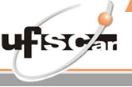

 Departamento de Computação (DComp-So) 
 Centro de Ciências e Gestão em Tecnologias (CCGT) 
 UNIVERSIDADE FEDERAL DE SÃO CARLOS - Campus Sorocaba   

# Sobre

Material criado para o seminário que aborda DevSecOps como parte da avaliação da disciplina de Engenharia de Software (2021/2) - Prof. Dr. Alexandre Alvaro, do programa de mestrado em Ciência da Computação da UFScar Sorocaba.

# NewSQL - Disponibilidade
Autores: Ailton Morais & Rocha
